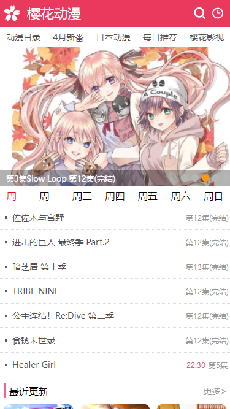

# yh-app 简介

yh-app是一个高度模仿手机端[__樱花动漫__](https://m.yhdmp.cc/)的前端项目,旨在提供一个通俗易懂、简洁明了的前端项目示例，帮助开发者熟悉例如vue、css以及uni这类比较常见的技术在实际项目开发中的使用方式，从而巩固所掌握到的前端技巧。

yh-app以[__vue__](https://v3.cn.vuejs.org/guide/introduction.html)作为开发框架，同时为了满足移动端跨平台的开发需求，使用[__uni-app__](https://uniapp.dcloud.io/)作为基础组件;为了写出比较标准的示例，yh-app在项目的规范上实际上参考了[__uView__](https://www.uviewui.com/guide/demo.html)的实现，yh-app亦可以作为研究uView源码的前菜；为了达到巩固技术的目的，yh-app坚持使用原生的css,展示如何使用例如flex来完成各种格式的布局。

yh-app 目前的项目演示成果如下:

可以通过访问[链接](http://120.79.26.3:8080/#/)预览这个项目效果。

> 需要注意的是 yh-app 只做了移动端的适配，由于基于 uni 进行开发，yh-app 可以运行在各种移动端平台，其中 h5移动端 、安卓以及微信小程序是已经验证过的。

## 项目目录

- api : 伪后台数据接口
- components : 项目组件
- doc : 项目文档
- libs : js功能支撑库
- pages : yh-app 的页面
- resource : 静态资源文件如图片
- static : 静态资源文件如css

## 关于接口

yh-app 并没有单独的后台接口，yh-app的后台接口是一个非常简易的伪数据接口，具体的实现可以仔细看看`api`以及`resource`。

但是为了能够正常地进行项目演示，yh-app将其暂时放置在了搭建在阿里云上的HTTP服务器，所以伪数据接口目前是可以直接访问的。

## 关于意见以及批评

作为一个供前端入门开发者学习的一个示例项目，yh-app热烈欢迎之处项目中的功能性缺陷，同时也欢迎指出项目中的非功能性缺陷。例如在css布局上如果你有更加好的解决方案，请不要吝啬你的想法。

## 关于交流

交流群:693640930

同时也麻烦各位老板帮我点点右上角的star，这次一定!!!

## 关于未来

yh-app 还会再继续开发吗?这一点当然会，最起码要做到跟原网页一致的效果嘛，当然我的目标应该不会局限于此。但是yh-app始终秉持一种编码态度，通俗易懂、简洁明了，yh-app不希望由于新增的新的页面增添了项目的阅读复杂程度。

yh-app将会与大家一起成长，相对于经验丰富者，笔者目前也只是一个菜鸟而已，但是笔者相信随着不断学习努力，总有一天笔者也能看到大佬的背影；yh-app也希望能与诸君一起成长。